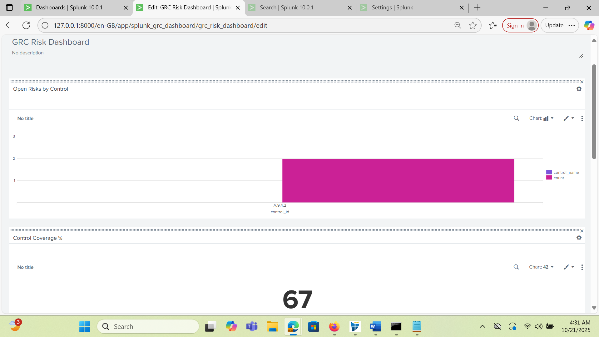
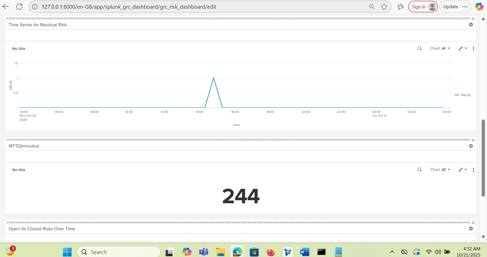
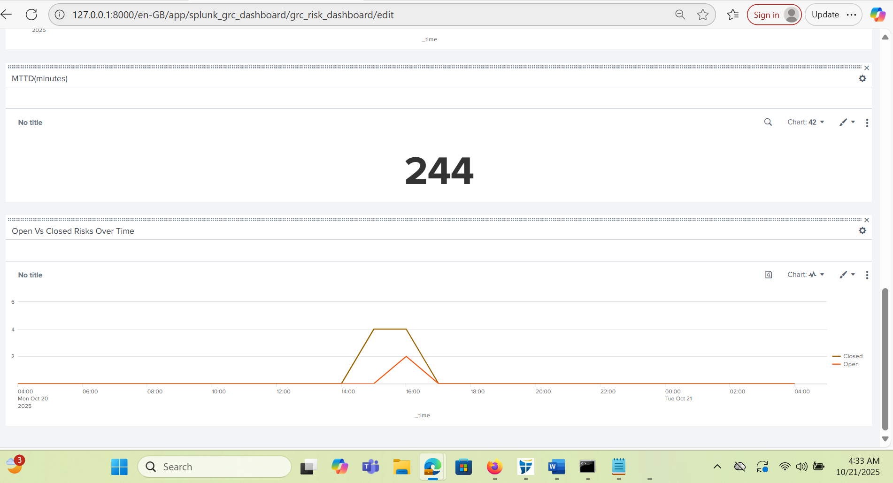

# Splunk GRC Risk Dashboard

### Overview
A Splunk-based Governance, Risk & Compliance (GRC) dashboard that maps detections to ISO 27001 & NIST CSF controls, automatically updates a risk register, and visualizes key KPIs like Control Coverage %, Residual Risk Trend, and Mean Time to Detect.

### Current Progress
- [x] Splunk app created (`splunk_grc_dashboard`)
- [x] Detection SPL built for failed logins
- [x] Control mappings via `control_map.csv`
- [x] Risk register automation
- [x] Dashboard panels built
- [ ] Screenshots upload (coming next)
- [ ] README finalization

### Next Steps
1. Upload lookup CSVs (`auth_logs.csv`, `control_map.csv`, `risk_register.csv`)
2. Add screenshots to `/screenshots`
3. Document all SPL searches under `/savedsearches`

4. ## Screenshots

**Open Risks by Control**

**Residual Risk Trend**

**MTTD**

**Open vs Closed Over Time**

